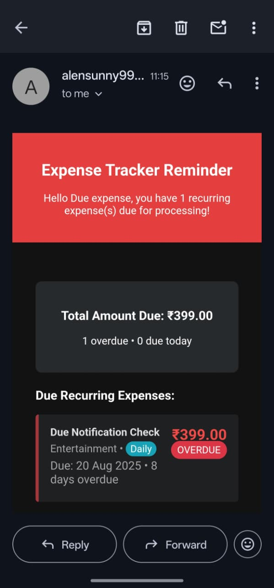
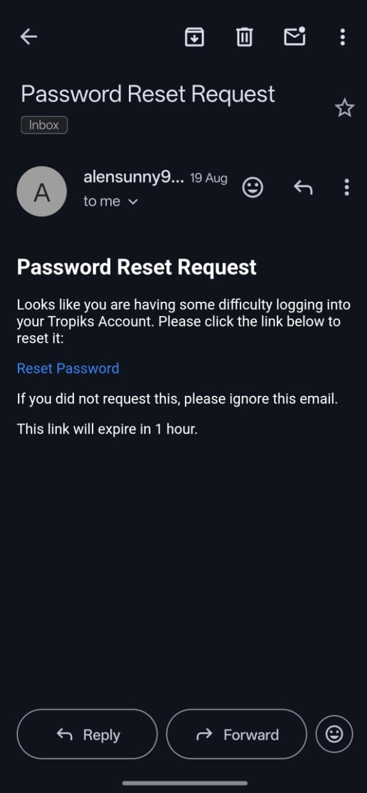

add categories of expense in your database like this or you can use custom route or flask-migrate.

flask shell(command)
in flask shell

from app.models.category import Category
from app.extensions import db

categories=['Food','Transportation','Entertainment','Utilities','Healthcare','Education','Bills','Other']
for cat_name in categories:
    if not Category.query.filter_by(name=cat_name).first():
        category = Category(name=cat_name)
        db.session.add(category)

db.session.commit()

for password reset feature set the variable inside your .env file:
    MAIL_SERVER=smtp.gmail.com,
    MAIL_PORT=587,
    MAIL_USE_TLS=True,
    MAIL_USERNAME,
    MAIL_PASSWORD,
    MAIL_DEFAULT_SENDER,
    SECURITY_PASSWORD_SALT

for gmail notification set these env variables:
    GOOGLE_CLIENT_ID,
    GOOGLE_CLIENT_SECRET,
    GOOGLE_REDIRECT_URI,
    GMAIL_SENDER_EMAIL,
    GOOGLE_REFRESH_TOKEN

Generates a 16-byte hex salt string Using Python one-liner:
    python -c "import secrets; print(secrets.token_hex(16))"

    
## Features

### Gmail Notification

### Password Reset

 Test your Flask app on mobile locally by accessing it from your phone:
    flask run --host=0.0.0.0 --port=5000

[ View Sample Expense Report PDF](app/static/images/expense_report_sample.pdf)